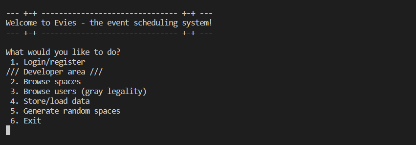
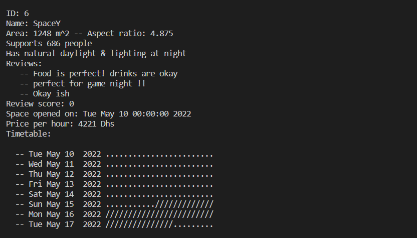
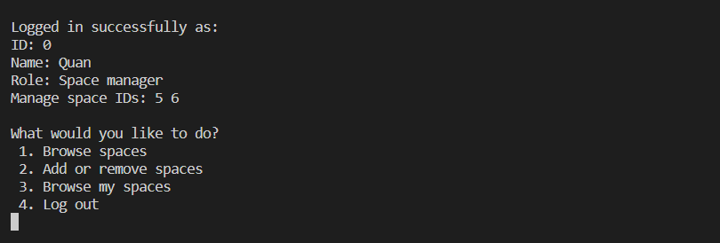
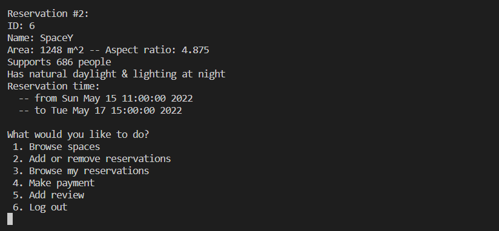

# evies-core
**Introduction**

C++ core for command-line event managing system.  The project relies on the generously provided JSON for Modern C++ library by nlohmann at https://github.com/nlohmann/json.

To compile and run the program only 4 files `main.cpp`, `space.hpp`, `user.hpp` and `json.hpp` are needed. The `magical.file` and `file.magical` files are database files that can be used to load pre-existing data. These data files are also stored in /backup_data in case they are accidentally overwritten.

The project was written for my class ENGR-UH 2510 Object-Oriented Programming.

**Gallery**

Main program menu:

Space and available times preview:

`SpaceUser` menu:

`EventUser` menu:
